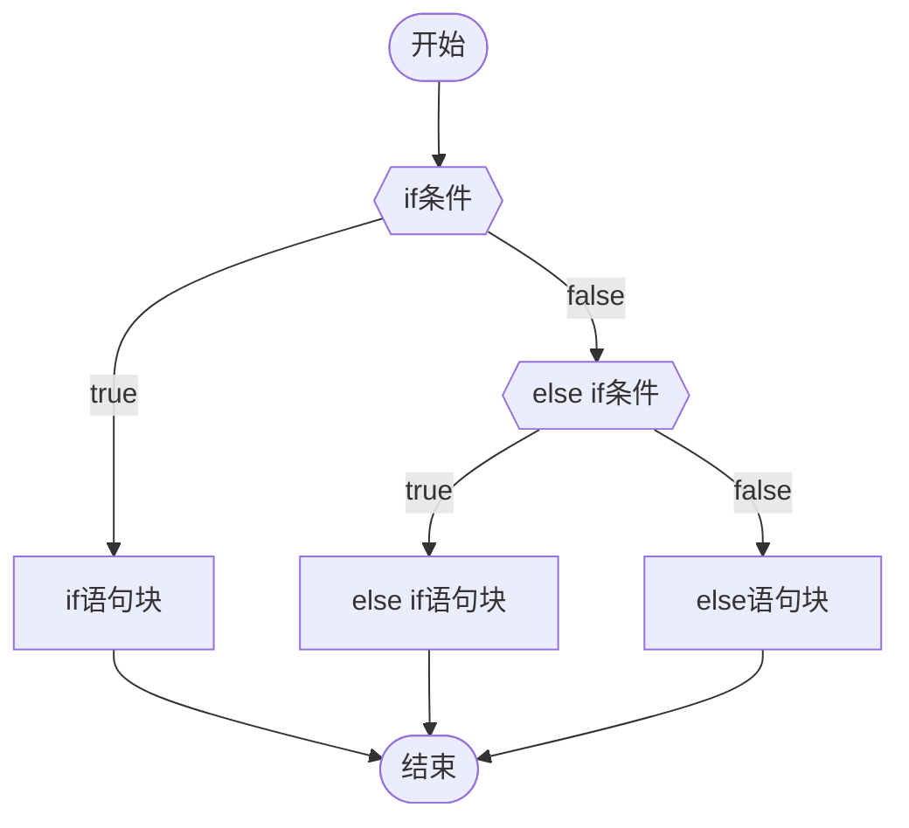
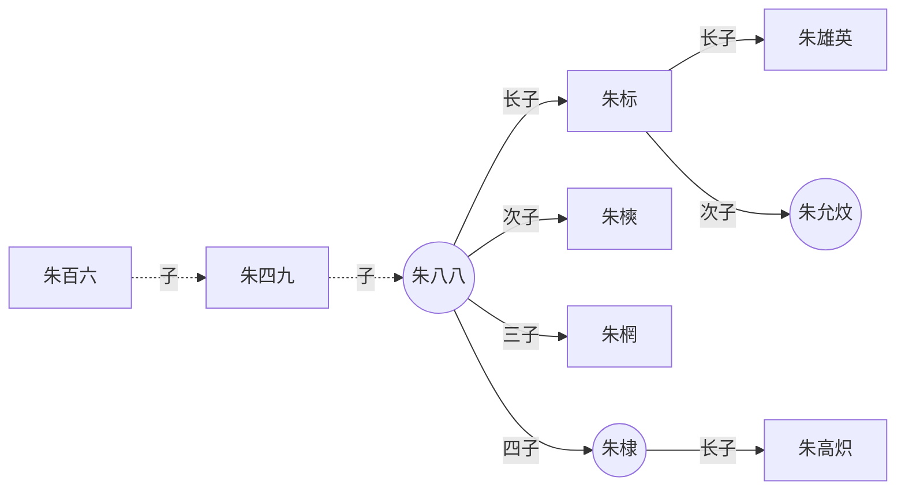
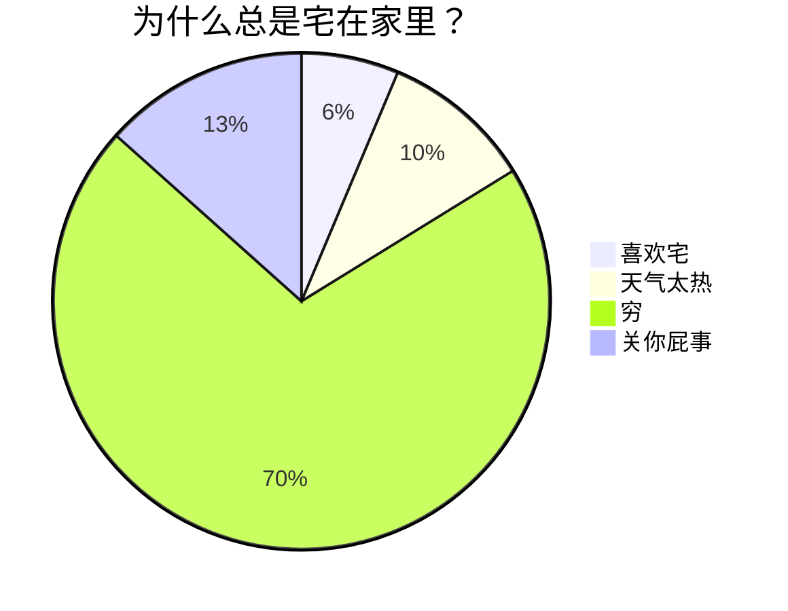
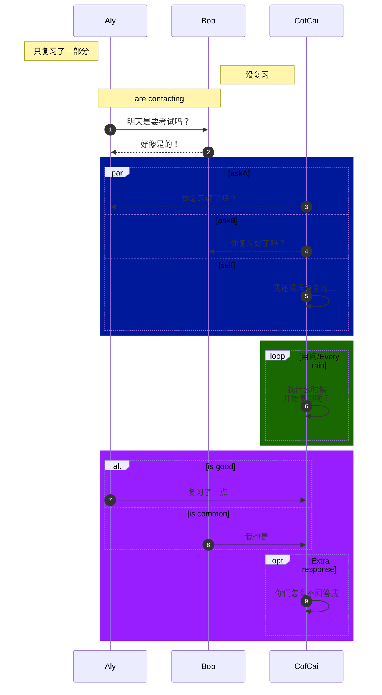
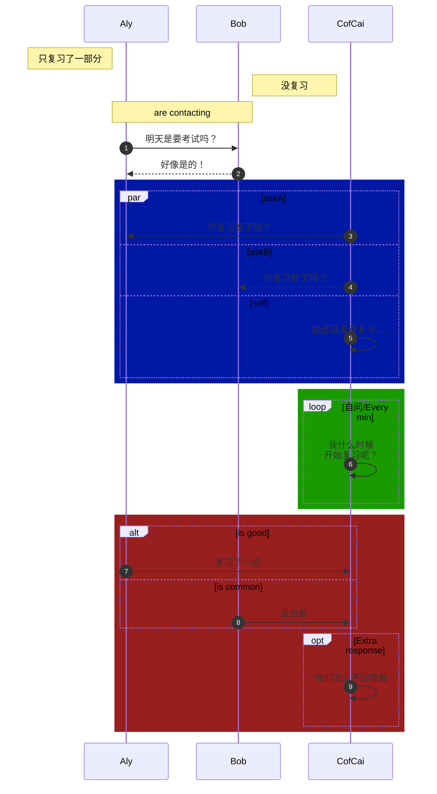
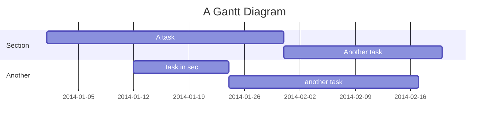
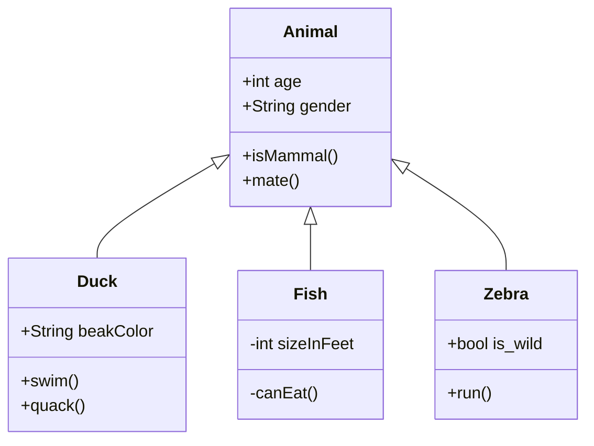

# 一、MarkDown

## 1. 标题

```
# 一级标题
## 二级标题
### 三级标题
#### 四级标题
##### 五级标题
###### 六级标题
```

## 二级标题

### 三级标题

#### 四级标题

##### 五级标题

###### 六级标题

## 2. 斜体

快捷键 <kbd>Ctrl</kbd> + <kbd>i</kbd>

```
*这里是一段斜体文本* 
_这也是一段斜体文本_
```

*这里是一段斜体文本*
_这也是一段斜体文本_

## 3. 粗体

快捷键 <kbd>Ctrl</kbd> + <kbd>b</kbd>

```
**这里是一段加粗文本**
__这也是一段加粗文本__
```

**这里是一段加粗文本**
__这也是一段加粗文本__

## 4. 粗斜体

```
***这里是一段粗斜文本***
___这也是一段粗斜文本___
```

***这里是一段粗斜文本***
___这也是一段粗斜文本___

## 5. 水平分割线

```
下面是一条水平分割线： 
---
***
```

---
***

## 6. 文本删除线

```
~~这是被删除的文本~~
```

~~这是被删除的文本~~

## 7. 文本下划线

```
<u>文本下划线</u>
```

<u>文本下划线</u>

## 8. 有序列表

```
1. 第一个有序列表
2. 第二个有序列表
3. 第三个有序列表
```

1. 第一个有序列表
2. 第二个有序列表
3. 第三个有序列表

## 9. 无序列表

快捷键 <kbd>Ctrl</kbd> + <kbd>Enter</kbd>

```
- 第一个无序列表
- 第二个无序列表
- 第三个无序列表
```

-  第一个无序列表
- 第二个无序列表
- 第三个无序列表

## 10. 引用

```
>引用一段话
>引用第二段话
```

>引用一段话
>引用第二段话

## 11. 缩进

快捷键 <kbd>Tab</kbd> 

快捷键 <kbd>Ctrl</kbd> + <kbd>[</kbd>

```
- 第一级无序列表1
	- 第二级无序列表1
```

- 第一级无序列表
	- 第二级无序列表1

## 12. 退格

快捷键 <kbd>Shift</kbd> <kbd>Tab</kbd> 

快捷键 <kbd>Ctrl</kbd> + <kbd>]</kbd>

```
- 第一级无序列表1
	- 第二级无序列表1
```

- 第一级无序列表
	- 第二级无序列表1


## 13. 超链接

快捷键 <kbd>Ctrl</kbd> + <kbd>k</kbd>

```
[显示文本内容](网址 空格 "提示文本")
```

[baidu](https://www.baidu.com/ "按住Ctrl跳转百度")

[**baidu**](https://www.baidu.com/ "按住Ctrl跳转百度")


## 14. 图像

```

```


## 15. 表格

```markdown
|这里是表头1|这里是表头2|这里是表头3|

|:-|:-:|-:|    
<!--区分表头和表格主体，:代表文本对齐方式，分别是左对齐，居中对齐，右对齐-->

|单元格数据1|单元格数据2|单元格数据3|
|单元格数据4|单元格数据5|单元格数据6|
```

| 这里是表头1 | 这里是表头2 | 这里是表头3 |
| :----: | :----: | :----: |
| 单元格数据1 | 单元格数据2 | 单元格数据3 |
| 单元格数据4 | 单元格数据5 | 单元格数据6 |

## 16. 代码

### 01 行内代码

```
``行内代码``
```

``<div style="width:10px;height:100;">``

### 02 代码块

````txt
```语言种类
代码内容
```
````

```java
public static void main(String[] args){
	System.out.println("Hello World");
}
```

### 03 代码块的嵌套

`````txt
````txt
```txt
```
````
`````

## 17.  任务列表

快捷键：**Ctrl** + **L** +待办文本内容

```
- [ ] 待办任务列表1
- [ ] 待办任务列表2
- [x] 已办任务列表1    <!-- 英文字母X -->
- [x] 已办任务列表2
```

- [ ] 待办任务列表1
- [ ] 待办任务列表2
- [x] 已办任务列表1  
- [x] 已办任务列表2

**任务列表也是可以缩进+退格的，操作跟 无序、有序列表一样**

## 18. 变量

```
[百度一下，你就知道][度娘]
[知乎-有问题，就会有答案][知乎] 

<!-- 这里是变量区域 -->
[度娘]: http://www.baidu.com
[知乎]: https://www.zhihu.com
```

[百度一下，你就知道][度娘]
[知乎-有问题，就会有答案][知乎] 

<!-- 这里是变量区域 -->
[度娘]: http://www.baidu.com
[知乎]: https://www.zhihu.com

## 19. 脚注

```
鲁迅原名是什么[^1] ，浙江哪里人[^2]

<!-- 这里是变量区域 -->
[^1]: 周树人
[^2]: 绍兴人
```

鲁迅原名是什么[^1] ，浙江哪里人[^2]

[^1]: 周树人
[^2]: 绍兴人

## 20. 文本格式

### 01 键盘文本

```
<kbd>Ctrl</kbd>
```

<kbd>Ctrl</kbd>+<kbd>C</kbd>

### 02 高亮文本

```
==这是一段高亮文字==
```

==这是一段高亮文字==

## 21. 转义字符

### 01 显示普通字符

```
\*\*不加粗的粗体\*\*
```

\*\*不加粗的粗体\*\*

### 02 表格内单元格

```
|表头1|表头2|
|-|-|
|这里的文本被\|分隔|这里的文本也被\|分隔|
```

|表头1|表头2|
|-|-|
|这里的文本被\|分隔|这里的文本也被\|分隔|

### 03 链接中的中括号

[链接里的\[中括号\]能被正常显示](https://www.runoob.com)

### 04 不会注释的 %

在 **Obsidian** 中 注释是前后各两个 `%` 号

%% 注释%%

\%\%不会注释\%\%

## 22. 标签

```
#标签名
```

#标签一

### 01 标签的嵌套

```
#主标签/子标签1
#主标签/子标签2
#主标签/子标签3
```

#主标签/子标签1
#主标签/子标签2
#主标签/子标签3

嵌套标签可以像普通标签一样通过点击来唤起搜索，嵌套标签允许你选择搜索的层次。例如：搜索 \#主标签 ，即可找到包含任意一个子标签的所有笔记，返回的结果会是上述的三个例子，当你在一个主分类下设置了多个子分类，想找到这个主分类包含的所有内容时，该功能会很实用


# 二、Mermaid

## 1. 竖向流程图

````

````


## 2. 横向流程图

````

````


## 3. 饼图

````

````


## 4. 序列图

````

````



## 5. 甘特图

````

````


## 6. 类图

````

````


# 三、Obsidian

## 1. 双链

^02e632
### 01 链接到文章

```
[[obsidian]]
```

[[obsidian]]

### 02 链接到文章某个段落

```
[[obsidian#1. 双链]]
```

[[obsidian#1. 双链]]

### 03 链接到文本块

```
[[obsidian#^02e632]]
```

[[obsidian#^02e632]]

### 04 链接别名

```
[[obsidian#1. 双链|双链]]
```

[[obsidian#1. 双链|双链]]

### 05 链接实时预览

```
![[obsidian#1. 双链|双链]]
```

![[obsidian#04 链接别名|双链]]

## 2. 快捷键

### 01 新建笔记

<kbd>Ctrl</kbd>+<kbd>N</kbd>

### 02 保存笔记

<kbd>Ctrl</kbd>+<kbd>S</kbd>

### 03 打开最近关闭的笔记

<kbd>Ctrl</kbd>+<kbd>T</kbd>

### 04 打开文件浏览器

<kbd>Ctrl</kbd>+<kbd>O</kbd>

### 05 跳转到搜索栏

<kbd>Ctrl</kbd>+<kbd>E</kbd>

### 06 搜索

当前笔记搜索：<kbd>Ctrl</kbd>+<kbd>F</kbd>
全部笔记搜索：<kbd>Ctrl</kbd>+<kbd>Shift</kbd>+<kbd>F</kbd>

### 07 注释

<kbd>Ctrl</kbd>+<kbd>/</kbd>

### 08 关系图谱

<kbd>Ctrl</kbd>+<kbd>G</kbd>

### 09 命令面板

<kbd>Ctrl</kbd>+<kbd>P</kbd>

## 3. 插件

### 01 Excalidraw

### 02 Pandoc

### 03 Calender

## 4. 技巧

模板
内容同步
命令面板
[数学公式](https://www.latexlive.com/)